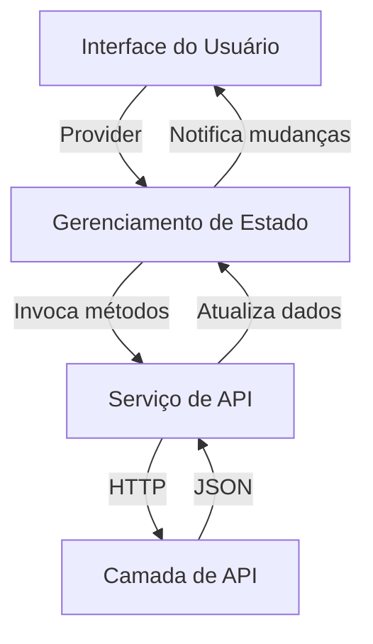

# Documentação da Integração com a Camada de API

## ✅ Commit de Implementação

**Mensagem de commit:** `feat(api): integração completa da API com gerenciamento de estado e atualização da interface`

Este commit marca a implementação da comunicação entre a camada de API e a aplicação, utilizando o pacote `Provider` para gerenciamento de estado e atualização automática da interface com base nos dados recebidos. Também foram adicionados indicadores de carregamento e mensagens de erro para melhor feedback ao usuário.

---

## 🧭 Diagrama de Arquitetura (Mermaid)



---

## 🔗 Endpoints da API Utilizados

### 🔹 Restaurantes
- `GET /restaurantes`: Lista todos os restaurantes.
- `GET /restaurantes/{id}`: Busca um restaurante específico.
- `POST /restaurantes`: Cria um novo restaurante.

### 🔹 Culinárias
- `GET /culinarias`: Lista todas as culinárias.

### 🔹 Avaliações
- `GET /avaliacoes`: Lista todas as avaliações.
- `GET /avaliacoes/{id}`: Detalhes de uma avaliação.
- `POST /avaliacoes`: Cria uma nova avaliação.

### 🔹 Usuários
- `GET /usuarios`: Lista todos os usuários.
- `GET /usuarios/{id}`: Busca um usuário específico.
- `POST /usuarios`: Cria um novo usuário.

---

## 🧩 Modelos de Dados

### Restaurante
```json
{
  "id_restaurante": 1,
  "nome": "Restaurante Exemplo",
  "endereco": "Rua Exemplo, 123",
  "id_culinaria": 2
}
```

### Culinária
```json
{
  "id_culinaria": 2,
  "tipo": "Italiana"
}
```

### Avaliação
```json
{
  "id_avaliacao": 10,
  "id_usuario": 3,
  "id_restaurante": 1,
  "nota": 5,
  "comentario": "Excelente comida!",
  "data": "2025-05-18"
}
```

### Usuário
```json
{
  "id_usuario": 3,
  "nome": "João da Silva",
  "email": "joao@email.com",
  "senha": "********"
}
```

---

## 📌 Observações

- Todos os serviços foram implementados com mecanismo de retry para maior robustez.
- O estado dos dados é mantido com `ChangeNotifier` e notifica automaticamente os widgets consumidores.
- Foram utilizados `CircularProgressIndicator` para carregamento e `Text` para exibição de erros.
